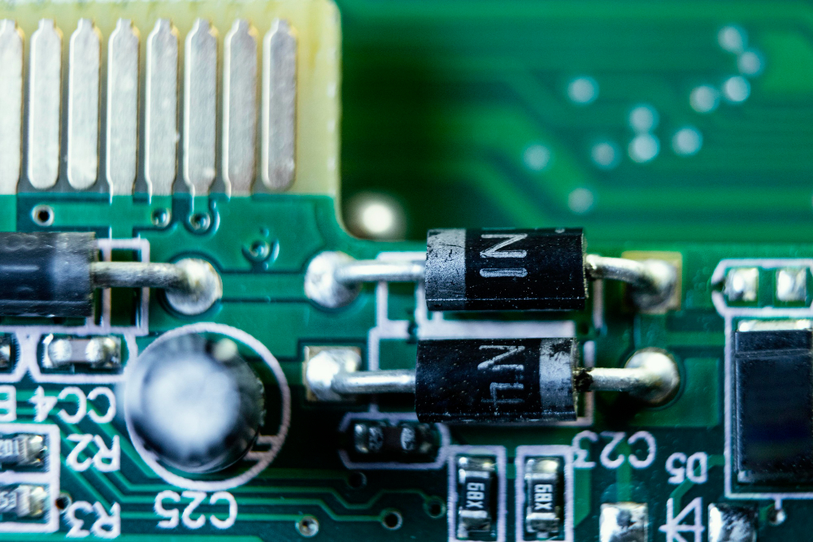
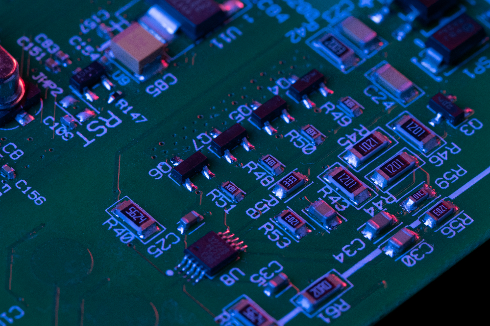

# Electrónica Analógica

La electrónica analógica constituye una disciplina esencial dentro de la ingeniería electrónica, dedicada al procesamiento de señales continuas que varían en amplitud, frecuencia o fase. A diferencia de las señales digitales, que se limitan a valores discretos (0 y 1), las señales analógicas representan fenómenos físicos de manera proporcional, como el sonido, la temperatura o la luz, lo que permite una interacción más fiel con el entorno. Esta rama de la electrónica se fundamenta en componentes pasivos (resistencias, capacitores, inductores) y activos (transistores, diodos, amplificadores operacionales), los cuales permiten operaciones críticas como la amplificación, el filtrado y la modulación de señales.

## Aplicaciones en Contextos Cotidianos

- **Sistemas de audio**: Los equipos de sonido, desde micrófonos hasta altavoces, emplean amplificadores analógicos para procesar señales de audio con alta fidelidad, manteniendo la riqueza de las ondas sonoras originales.

- **Control de temperatura**: Termostatos en hornos y sistemas de climatización utilizan sensores analógicos para medir y ajustar la temperatura de manera continua y precisa.

- **Automoción**: Sensores analógicos monitorizan variables como la presión de los neumáticos, el nivel de combustible o la posición del acelerador, enviando señales proporcionales a las unidades de control.

- **Dispositivos médicos**: Electrocardiógrafos (ECG) y glucómetros capturan señales fisiológicas mediante circuitos analógicos, traduciendo fenómenos biológicos en datos interpretables.

- **Telecomunicaciones tradicionales**: La radiodifusión AM/FM y la televisión analógica basan su funcionamiento en la modulación de ondas electromagnéticas, permitiendo la transmisión de información sin conversión digital.

A pesar del predominio de la electrónica digital en el procesamiento de datos, los sistemas analógicos siguen siendo insustituibles en aplicaciones que requieren una respuesta en tiempo real y una interfaz directa con variables físicas. Su estudio resulta fundamental para comprender el diseño de dispositivos electrónicos integrados en la vida diaria y en entornos industriales.

## Referencias

- Boylestad, R. L., & Nashelsky, L. (2013). *Electronic Devices and Circuit Theory* (11.ª ed.). Pearson.
- Sedra, A. S., & Smith, K. C. (2014). *Microelectronic Circuits* (7.ª ed.). Oxford University Press.
- Floyd, T. L. (2018). *Electronic Devices* (10.ª ed.). Pearson.

# Dispositivos Activos

Los dispositivos activos se definen como componentes electrónicos que requieren una fuente de energía externa para modificar, amplificar o conmutar señales eléctricas. A diferencia de los elementos pasivos, estos dispositivos introducen ganancia (incremento de amplitud) o control direccional al flujo de corriente, siendo fundamentales en circuitos analógicos y digitales. Tres atributos los distinguen:

- **Dependencia energética:** Utilizan alimentación externa (ej.: baterías, fuentes DC) para operar.
- **No linealidad:** Su respuesta voltaje-corriente no sigue una relación proporcional (ej.: diodos en polarización inversa).
- **Funcionalidad dinámica:** Pueden actuar como amplificadores, interruptores o reguladores según su configuración.

## Clasificación y Ejemplos Representativos

La Tabla 1 resume los principales dispositivos activos y sus funciones:

| **Dispositivo**      | **Función Primaria**        | **Ejemplo de Aplicación**                           |
|-----------------------|----------------------------|----------------------------------------------------|
| Transistores (BJT)    | Amplificación/conmutación  | Etapas de potencia en amplificadores de audio      |
| Diodos (Zener)        | Regulación de voltaje      | Fuentes de alimentación estabilizadas              |
| Tiristores (SCR)      | Control de potencia en CA  | Sistemas de iluminación dimmable                  |

## Relación con Materiales Semiconductores

Estos dispositivos se fabrican mediante uniones de materiales semiconductores tipo **N** (portadores mayoritarios: electrones, dopado con fósforo) y tipo **P** (portadores mayoritarios: huecos, dopado con boro). La interacción entre estas regiones explica comportamientos como:

- La rectificación en diodos (unión PN).
- El efecto amplificador en transistores (uniones NPN o PNP).

## Relevancia en el Plan de Estudios

Comprender los dispositivos activos sienta las bases para temas avanzados como:

- **Diodos especializados:** LED (emisores de luz), Zener (regulación).
- **Transistores BJT:** Configuraciones en emisor común, base común.
- **Tiristores:** SCR en control de motores, TRIAC en sistemas domésticos.

## Referencias

- Boylestad, R. L. (2013). *Electronic Devices and Circuit Theory* (11.ª ed.). Pearson.
- Floyd, T. L. (2018). *Electronic Devices* (10.ª ed.). Pearson.
- Avila, F. (2012). *Sintaxis y Estructura en Textos Técnicos*. Editorial ECCI.

# **Materiales Semiconductores Tipo N y Tipo P

Los materiales semiconductores tipo N y tipo P son esenciales en el diseño de dispositivos electrónicos modernos, como diodos, transistores y tiristores. Estos materiales se desarrollan mediante un proceso conocido como **dopaje**, que consiste en introducir impurezas controladas en un semiconductor intrínseco (como el silicio o el germanio) para modificar sus propiedades eléctricas. Este proceso permite crear regiones con diferentes tipos de portadores de carga, fundamentales para el funcionamiento de los dispositivos electrónicos.

---

## **Semiconductores Intrínsecos y Extrínsecos**
Un semiconductor intrínseco es un material puro que tiene baja conductividad eléctrica a temperatura ambiente. Sin embargo, al ser dopado con elementos específicos, se convierte en un semiconductor extrínseco, aumentando su capacidad conductiva. Este dopaje genera dos tipos principales de semiconductores:

1. **Tipo N**: Portadores mayoritarios son electrones libres (carga negativa).  
2. **Tipo P**: Portadores mayoritarios son huecos (carga positiva efectiva).

---

## **Materiales Semiconductores Tipo N**

Los semiconductores tipo N se obtienen añadiendo átomos pentavalentes (del grupo V de la tabla periódica), como fósforo (P), arsénico (As) o antimonio (Sb). Estos átomos tienen cinco electrones de valencia, de los cuales cuatro forman enlaces covalentes con el silicio, mientras que el quinto queda libre para moverse dentro del material, incrementando su conductividad.

### **Características Principales**
- **Portadores mayoritarios**: Electrones libres.  
- **Portadores minoritarios**: Huecos.  
- **Conductividad mejorada**: Gracias a la alta densidad de electrones libres.  
- **Aplicaciones comunes**: Capas emisoras en transistores bipolares (BJT) y regiones activas en diodos.

---

## **Materiales Semiconductores Tipo P**
Los semiconductores tipo P se producen mediante la incorporación de átomos trivalentes (del grupo III de la tabla periódica), como boro (B), indio (In) o galio (Ga). Estos átomos tienen tres electrones de valencia, lo que genera huecos al no completar los cuatro enlaces covalentes necesarios con el silicio. Los huecos actúan como portadores positivos dentro del material.

### **Características Principales**
- **Portadores mayoritarios**: Huecos.  
- **Portadores minoritarios**: Electrones libres.  
- **Conductividad mejorada**: Debido al movimiento de huecos en el material.  
- **Aplicaciones comunes**: Bases en transistores bipolares y regiones activas en diodos LED.

---

## **Comparación entre Tipo N y Tipo P**
| **Característica**       | **Tipo N**                          | **Tipo P**                          |
|--------------------------|-------------------------------------|-------------------------------------|
| **Dopante utilizado**    | Grupo V (P, As, Sb)                | Grupo III (B, In, Ga)               |
| **Portadores mayoritarios** | Electrones (-)                     | Huecos (+)                          |
| **Conductividad eléctrica** | Dominada por electrones libres     | Dominada por movimiento de huecos   |

---

## **Unión PN**
La combinación de un semiconductor tipo N con uno tipo P forma una unión PN, que es la base para dispositivos como diodos y transistores. En esta unión:  
1. Los electrones del tipo N difunden hacia el tipo P, mientras que los huecos del tipo P migran hacia el tipo N.  
2. Se genera una zona de deplexión donde se establece un campo eléctrico interno que permite la rectificación de corriente eléctrica.

---

## **Aplicaciones Prácticas en Electrónica**
1. **Diodos PN:** Rectificadores y reguladores de voltaje (diodos Zener).  
2. **Transistores BJT:** Amplificadores y conmutadores electrónicos en configuraciones NPN o PNP.  
3. **Tiristores:** Controladores de potencia en sistemas industriales y domésticos (SCR y TRIAC).

---

## **Referencias Bibliográficas**
- Boylestad, R., & Nashelsky, L. (2013). *Electronic Devices and Circuit Theory* (11ª ed.). Pearson Education.  
- Floyd, T.L. (2018). *Electronic Devices* (10ª ed.). Pearson Education.  
- Sze, S.M., & Ng, K.K. (2007). *Physics of Semiconductor Devices* (3ª ed.). Wiley-Interscience.  
