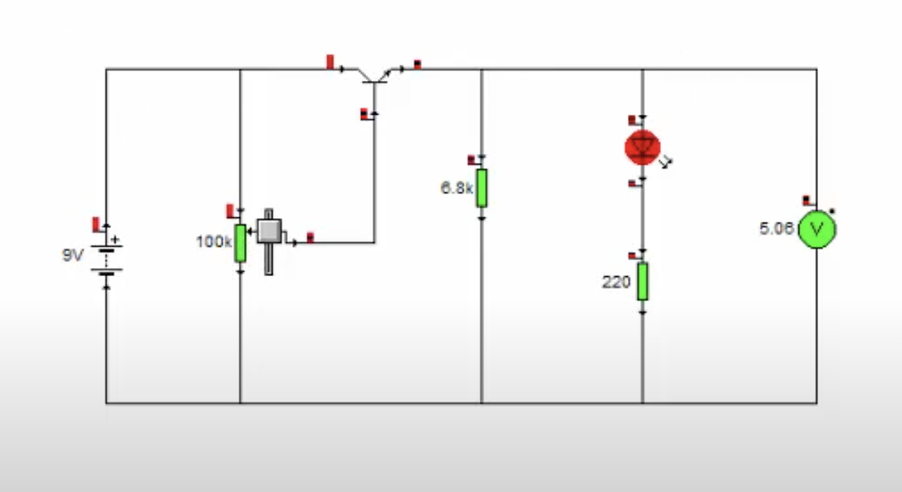
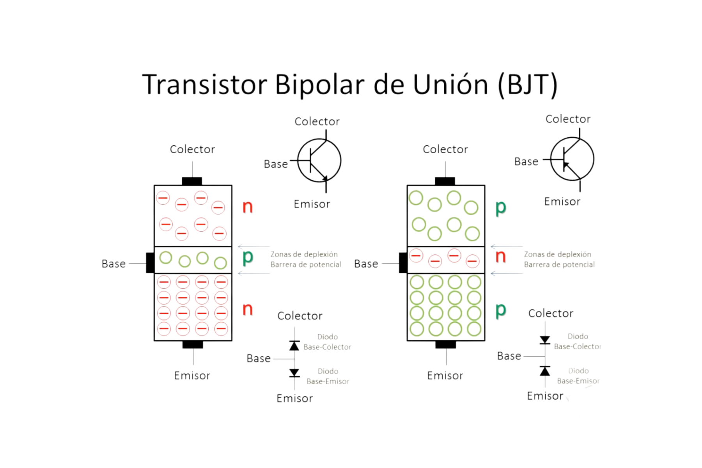
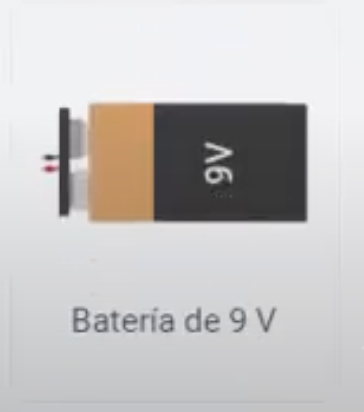
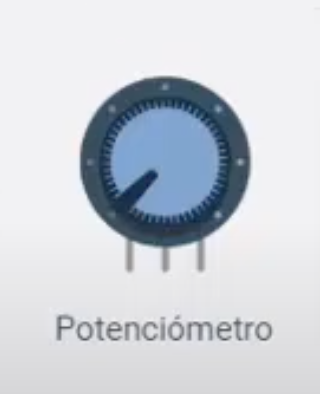

## Fuente de Poder Variable con Transistor BJT y Batería de 9V  
**Objetivo:** Diseñar una fuente de alimentación ajustable (0.7V a ~8V) utilizando un transistor BJT NPN, potenciómetro y resistencias, integrando principios de dispositivos activos en electrónica analógica.
---

### Introducción al Uso de Transistores como Dispositivos Activos  
Los **transistores BJT** son dispositivos activos que permiten controlar el flujo de corriente entre el colector y el emisor mediante una señal en la base. En esta práctica, se utilizará un transistor NPN en configuración de **seguidor de emisor**, donde el voltaje de salida sigue al voltaje aplicado en la base (menos la caída $$ V_{BE} \approx 0.7 \, \text{V} $$).  

Este circuito demuestra cómo los transistores:  
- Actúan como **amplificadores de corriente**.  
- Permiten regular voltajes mediante divisores resistivos.  
- Requieren polarización adecuada para operar en la región activa.  

---

### Materiales Necesarios (Simulación en Tinkercad)  
1. **Transistor BJT NPN** (ej. 2N2222).
  
2. Batería de 9V (fuente de entrada).  
 
3. Potenciómetro de 10kΩ (ajuste de voltaje).  
 
4. Resistencias: 1kΩ (base), 470Ω (emisor).  
 
5. Protoboard, cables y multímetro virtual.  
 
---

### Pasos para Construir el Circuito  
#### 1. Configuración del Divisor de Voltaje  
- Conecta el potenciómetro de 10kΩ entre los polos positivo (+) y negativo (-) de la batería. El terminal central del potenciómetro será la **salida de referencia** ($$ V_{\text{base}} $$).  
```plaintext  
Batería 9V → Potenciómetro (extremos)  
```

#### 2. Polarización del Transistor  
- Une el terminal central del potenciómetro a la **base del transistor** mediante una resistencia de 1kΩ (limita la corriente de base).  
- Conecta el **colector** directamente al polo positivo de la batería.  
- Agrega una resistencia de 470Ω entre el **emisor** y tierra. El voltaje de salida ($$ V_{\text{out}} $$) se mide en el emisor.  
```plaintext  
Pot (central) → R1kΩ → Base  
Colector → Batería (+)  
Emisor → R470Ω → Tierra  
```

#### 3. Fórmula de Voltaje de Salida  
El circuito sigue la relación:  
$$ V_{\text{out}} = V_{\text{base}} - V_{BE} $$  
Donde:  
- $$ V_{\text{base}} $$ depende de la posición del potenciómetro (0-9V).  
- $$ V_{BE} \approx 0.7 \, \text{V} $$ (caída base-emisor).  

**Rango teórico:**  
- Mínimo: $$ 0.7 \, \text{V} $$ (cuando $$ V_{\text{base}} = 0.7 \, \text{V} $$).  
- Máximo: $$ 8.3 \, \text{V} $$ (si $$ V_{\text{base}} = 9 \, \text{V} $$), pero en la práctica, limitado por la saturación del transistor (~8V).  

---

### Simulación y Pruebas  
1. **Ajuste del potenciómetro:** Gíralo para variar $$ V_{\text{base}} $$.  
2. **Medición:** Usa el multímetro virtual para verificar $$ V_{\text{out}} $$ en el emisor.  
3. **Análisis:** Observa cómo $$ V_{\text{out}} $$ sigue a $$ V_{\text{base}} $$ menos $$ 0.7 \, \text{V} $$, validando la función del transistor como dispositivo activo.  

---

### Funcionamiento del Transistor como Dispositivo Activo  
- **Región activa:** El transistor actúa como un amplificador, donde $$ I_C = \beta \cdot I_B $$.  
- **Retroalimentación:** La resistencia de emisor (470Ω) estabiliza la corriente, evitando variaciones bruscas.  
- **Limitaciones:** La corriente máxima está determinada por $$ R_{\text{emisor}} $$ y la capacidad del transistor (2N2222 soporta hasta 800mA).  

---

### Diagrama del Circuito en Tinkercad  
```plaintext  
Batería 9V  
(+)  
│  
├───Colector (Transistor)  
│  
└───Potenciometro (10kΩ extremos)  
    │  
    ├─Central─R1kΩ─Base (Transistor)  
    │  
    └───Tierra  
Emisor (Transistor)─R470Ω─Tierra  
```

---

### Conclusión  
Este diseño reemplaza componentes integrados (LM317) con un transistor BJT, demostrando cómo los dispositivos activos básicos permiten construir circuitos reguladores ajustables. La práctica refuerza conceptos clave como polarización, región activa y divisores de voltaje, esenciales para aplicaciones en electrónica analógica.

---
Respuesta de Perplexity: pplx.ai/share
