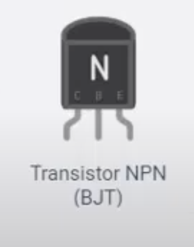

#  Fuente de Poder Variable con Transistor NPN

## Introducción

En el estudio de la electrónica analógica, los dispositivos activos juegan un papel fundamental para el control y manipulación de señales eléctricas. A diferencia de los dispositivos pasivos, los activos —como los transistores— son capaces de amplificar, conmutar o modular una señal. Esta práctica se centra en la implementación de una fuente de poder variable utilizando un transistor BJT NPN, uno de los componentes activos más utilizados en circuitos analógicos. Mediante el uso de un potenciómetro se logra variar la tensión de salida, demostrando así el principio de amplificación y control de corriente que caracteriza a los transistores. Esta actividad proporciona una experiencia práctica que consolida el entendimiento de conceptos clave como el funcionamiento del emisor seguidor, el control de ganancia y la polarización del transistor, empleando el simulador Tinkercad como herramienta de experimentación virtual.

## Componentes

- 1x Batería de 9V

- 1x Transistor NPN (ej: 2N2222 o BC547)

- 1x Potenciómetro (10kΩ recomendado)

- 2x Resistencias (1kΩ y 220Ω)

- 1x Protoboard

- 1x LED (opcional, para prueba de salida)

- Cables de conexión

## Objetivo

Construir una fuente de alimentación ajustable (0.7V a ~8V) utilizando un transistor BJT NPN, potenciómetro y resistencias, integrando principios de dispositivos activos en electrónica analógica como se muestra en el siguiente circuito.

## Simulador

Usaremos [Tinkercad Circuits](https://www.tinkercad.com/) para el armado virtual.

## Pasos

### 1. Conectar la fuente de 9V

- Coloca la batería de 9V en el área de trabajo.
- Conecta el terminal positivo (+) al riel positivo de la protoboard.
- Conecta el terminal negativo (–) al riel negativo (GND).

### 2. Agregar el transistor NPN

- Coloca un transistor NPN en la protoboard.
- Identifica sus pines: **Colector (C)**, **Base (B)** y **Emisor (E)**.

### 3. Conectar el potenciómetro

- Coloca el potenciómetro en la protoboard.
- Conecta los extremos del potenciómetro a:
  - Un lado al riel positivo (+)
  - Otro lado al GND
- Conecta el pin del medio del potenciómetro a la **base del transistor** a través de una **resistencia de 1kΩ**.

### 4. Conectar la carga (opcional LED)

- Conecta un **LED** con una **resistencia de 220Ω** desde el **emisor del transistor** hacia GND.
- Esto permitirá observar la variación de voltaje.

### 5. Alimentar el colector

- Conecta el **colector del transistor** directamente al riel positivo (+) de la batería.

### 6. Salida variable

- La salida variable estará en el **emisor del transistor**.
- Puedes conectar un multímetro desde el emisor a GND para observar cómo varía el voltaje al girar el potenciómetro.

## Resultado Esperado

Al variar el potenciómetro, cambiará la tensión en la **base** del transistor, y el transistor actuará como seguidor de voltaje, dando una salida variable en el **emisor**, menor que la entrada (por la caída V\_BE de \~0.7V).

## Notas

- El transistor actúa como un **emisor seguidor**, ideal para regular pequeñas cargas.
- Para alimentar dispositivos más exigentes, se pueden usar transistores de mayor corriente o un regulador como el LM317.

## Experimento Adicional (opcional)

- Reemplaza el LED con un pequeño motor o ventilador y observa cómo cambia la velocidad al variar el voltaje de salida.

## Captura de Circuito

# Actividad complementaria

Una vez completada la práctica con el transistor NPN, realiza las siguientes modificaciones:

1. Sustituye el transistor BJT y el potenciómetro por un regulador de voltaje **LM317**.
2. Investiga el diagrama de conexión típico del LM317 para obtener una salida variable.
3. Utiliza resistencias fijas y/o un potenciómetro para ajustar la tensión de salida.
4. Mide la tensión de salida en diferentes configuraciones de resistencia y documenta tus observaciones.
5. Toma capturas de pantalla de tu circuito y resultados.

# Rúbrica de evaluación

| Criterio                                      | Excelente (10)                                            | Bueno (8)                                               | Aceptable (6)                                          | Deficiente (0-5)                                        |
|----------------------------------------------|-----------------------------------------------------------|---------------------------------------------------------|--------------------------------------------------------|---------------------------------------------------------|
| Implementación de LM317                      | Circuito funcional, conexiones correctas y ordenadas      | Circuito funcional con mínimas fallas                   | Circuito funcional pero con errores de conexión         | Circuito incompleto o sin funcionamiento                |
| Documentación del circuito                   | Incluye diagrama, capturas y descripción clara            | Incluye capturas y descripción aceptable                | Incluye solo capturas o una descripción muy breve       | Sin documentación o incompleta                         |
| Variabilidad de la salida                    | Se muestran claramente diferentes valores de salida       | Muestra dos o más variaciones de voltaje                | Sólo una medición o valores poco claros                 | No se muestra variación de salida                      |
| Entrega puntual                              | Entregado a tiempo y con todos los requisitos             | Entregado con ligero retraso o con un pequeño faltante  | Entregado tarde o con faltantes importantes             | No entregado o incompleto                             |
| Presentación general del archivo entregado   | Ordenado, legible y bien etiquetado                       | Legible, con algunos detalles menores                   | Poco ordenado o con etiquetas confusas                  | Desordenado, ilegible o con nombre incorrecto          |

